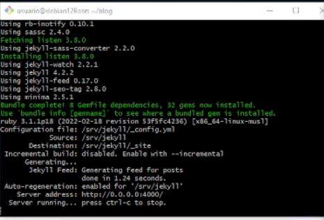

# Tutorial Creación de un contenedor Docker con Jekyll
## 1. Introducción
En este tutorial, aprenderemos a crear un contenedor Docker utilizando la imagen oficial de Jekyll desde Docker Hub.   
Jekyll es una herramienta que nos permite construir sitios web estáticos de manera sencilla.

## 2. Elección de la imagen Jekyll
En Docker Hub, encontramos tres imágenes oficiales de Jekyll:

jekyll/jekyll: Imagen por defecto.   
jekyll/minimal: Imagen muy minimalista.   
jekyll/builder: Incluye herramientas adicionales.   
En esta práctica, utilizaremos la imagen por defecto jekyll/jekyll.   

## 3. Ejecución de comandos básicos de Jekyll
### 3.1 Consultar comandos disponibles
Para conocer todos los comandos que podemos ejecutar con Jekyll, utilizamos el siguiente comando Docker:   

` docker run -it --rm -v "$PWD:/srv/jekyll" jekyll/jekyll jekyll `    
Esto nos proporcionará la lista de comandos y opciones disponibles.

### 3.2 Crear un nuevo proyecto Jekyll
Utilizamos el siguiente comando para crear la estructura de directorios y archivos necesarios para un nuevo proyecto Jekyll:

` docker run -it --rm -v "$PWD:/srv/jekyll" jekyll/jekyll jekyll new blog `

### 3.3 Añadir la gema necesaria para que funcione.
Para ello hay que editar el archivo gemfiles.   
   
Y añadir la gema webrick   

### 3.4 Servir el sitio localmente
Utilizamos el siguiente comando para servir localmente el sitio HTML estático generado:

`docker run -it --rm -p 4000:4000 -v "$PWD:/srv/jekyll" jekyll/jekyll jekyll serve --force_polling`   
La opción --force_polling permite que el contenido del sitio se actualice automáticamente al realizar cambios en los archivos del proyecto.    

Nota: Ejecute este comando dentro del directorio que contiene el contenido del blog.   
Una vez cargue el comando estara encendido el sitio HTML estatico con jekyll    

## 4. Visualización del sitio web
Para visualizar el sitio web, abrimos un navegador y accedemos a la dirección de localhost en el puerto 4000:

http://127.0.0.1:4000    

También podemos acceder a través de la dirección IP de nuestra máquina. 

