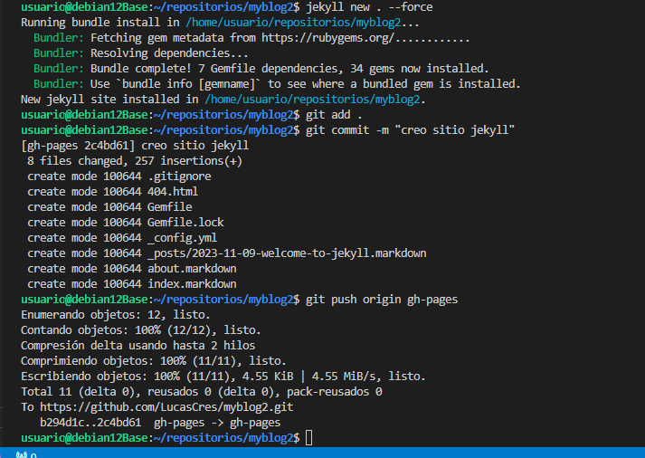
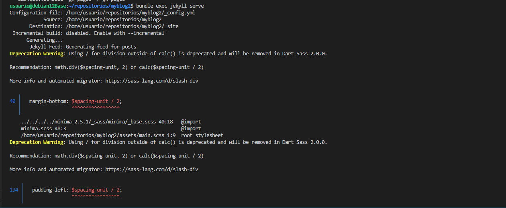
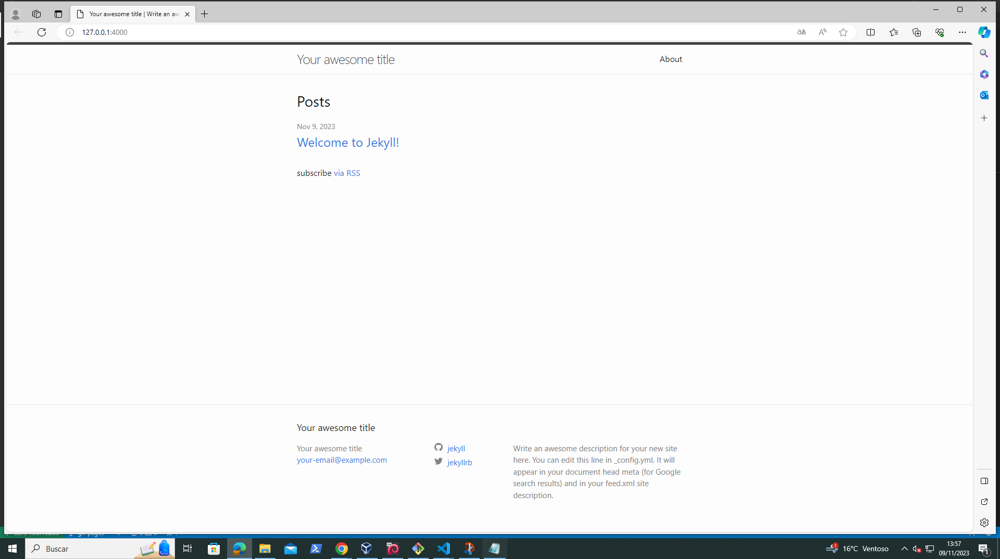
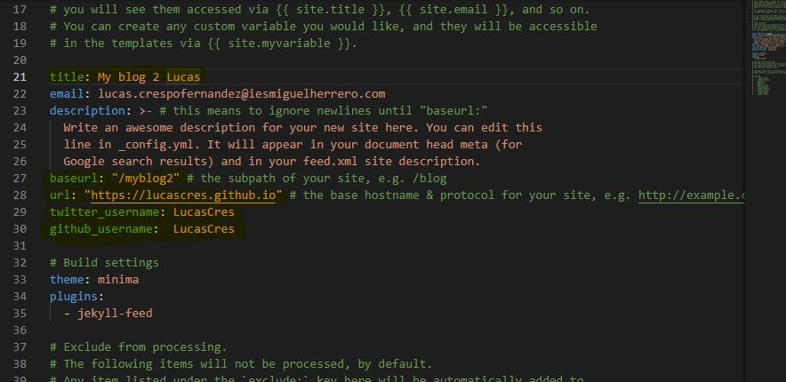
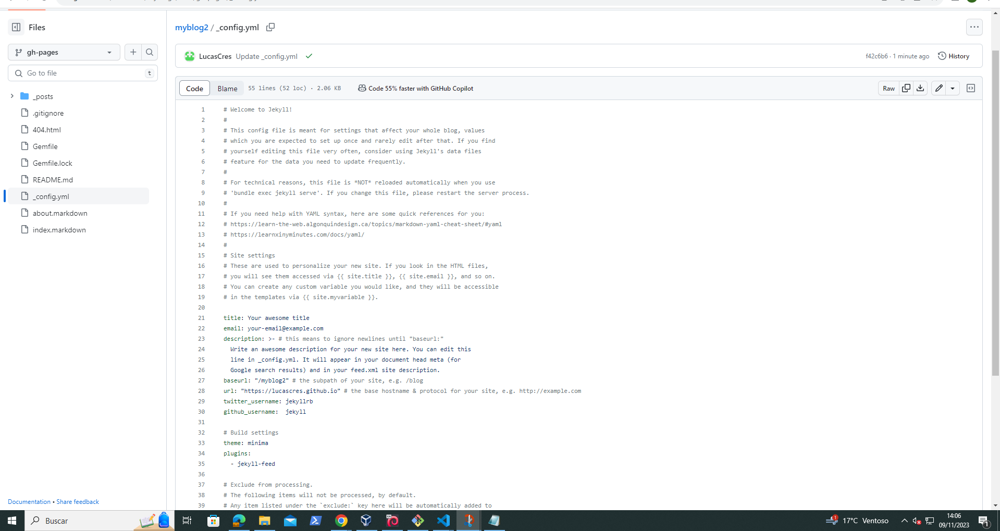

# Generar Paginas Estataticas en jekyll
---
+ Primer paso crear el repositorio en mi caso MyBlog2, hacer el git remote y generar la rama gh-pages
  
+ Segundo paso creamos un readme comprobamos que se ha creado la rama
   
+ Tercer paso crear un nuevo sitio de Jekyll hacemos su commit correspondiente y git push
   
+ Cuarto paso Lanzar el sitio para comprobar que se a creado correctamente
   
+ Quinto paso Abrir en el navegador el enlace que genera cuando lo lanzamos y comprobar que se a creado correctamente
   
+ Sexto paso Si cuando abras en el navegador no sale con el mismo formato que en la captura anterior es porque hay que configurar el config.yml se puede editar desde github o en el visual con un nano.
   
  
+ Y ya estaria creado un sitio jekyll con el tema por defecto minima
   